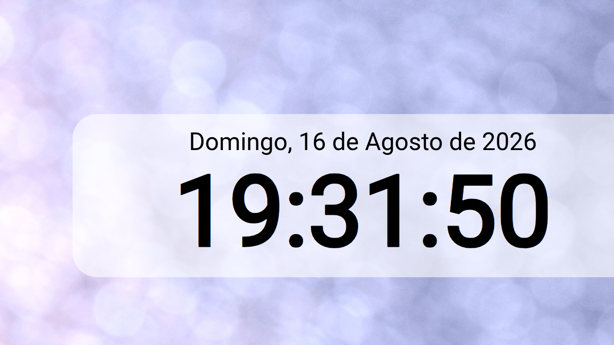
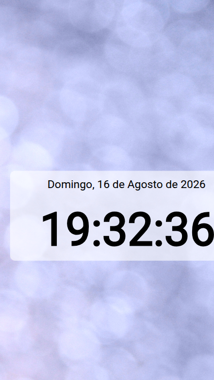

# DSPLAY - Digital Clock

A Vanilla JavaScript + jQuery [HTML-based template](https://developers.dsplay.tv/docs/html-templates) for the [DSPLAY - Digital Signage](https://dsplay.tv/) platform — a full-screen digital clock with a colored bar and an optional background image.

## Supported screen formats

| Landscape | Portrait |
|-----------|----------|
|  |  |

| Horizontal banner | Vertical banner |
|--------------------|-------------------|
|  |  |

## Template variables

| Key           | Type   | Description                                    |
|---------------|--------|--------------------------------------------------|
| `background`  | image  | The background image.                             |
| `barColor`    | color  | Color of the clock's bar. Defaults to `#FFF`.     |
| `barOpacity`  | string | Opacity of the clock's bar (`0`..`1`). Defaults to `0.6`. |
| `dateColor`   | color  | Color of the date text. Defaults to `#000`.       |
| `timeColor`   | color  | Color of the time text. Defaults to `#000`.       |

> Remember to also register these as Template Vars (same name and type) when configuring this template in the DSPLAY CMS.

## Local development

```sh
npm install
npm start
```

then visit `http://localhost:3000` (visit the root URL, not `http://localhost:3000/index.html` directly — the reload script is only injected on that path). The page auto-reloads whenever you edit and save a file.

`scripts/dsplay-data.js` defines `dsplay_config`/`dsplay_media`/`dsplay_template` mock globals used only when the template isn't running inside the actual DSPLAY app. Edit it to try out different variable values — the DSPLAY Player App replaces it with real content at runtime.

## Generating the template package

```sh
npm run zip
```

This first runs [`dsplay-scan-template`](https://www.npmjs.com/package/@dsplay/template-manifest) (from `@dsplay/template-manifest`), which statically scans `scripts/app.js` and captures `dsplay-data.js` as example data — writing `template-variables.json` + `template-example-data.json` to the project root. It then zips `index.html`, `assets/`, `scripts/`, `styles/`, and the two generated JSON files into `template.zip`.

## Deploying

Upload the resulting `template.zip` to the [DSPLAY Web Manager](https://manager.dsplay.tv/template/create).

## Updating vendored dependencies

See [AGENTS.md](AGENTS.md).

## More

To see more about DSPLAY HTML Templates, visit: https://developers.dsplay.tv/docs/html-templates
